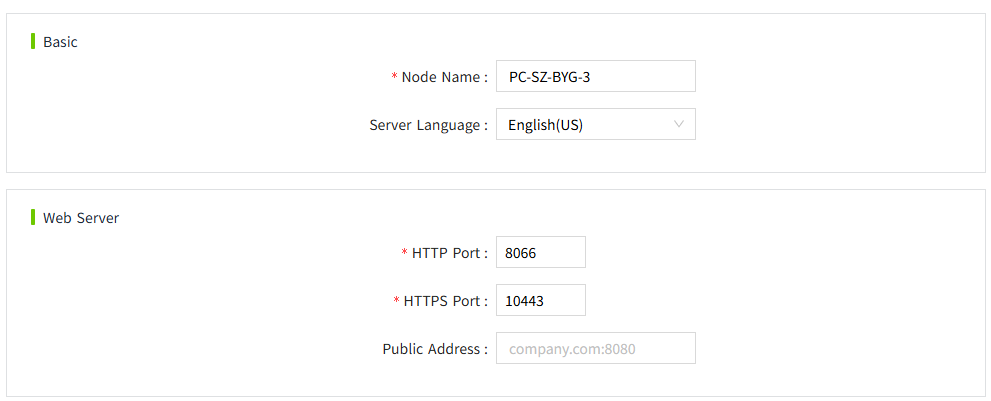
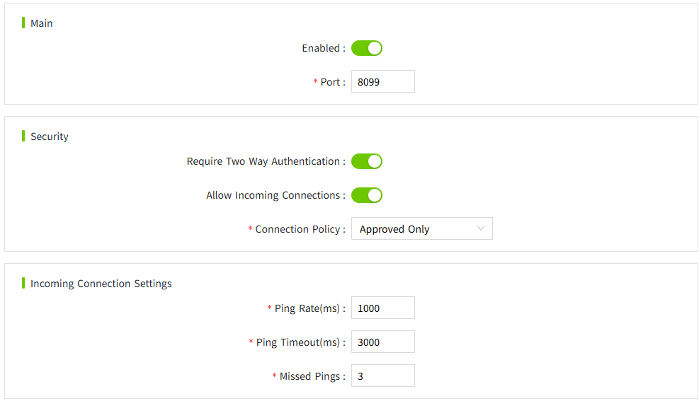
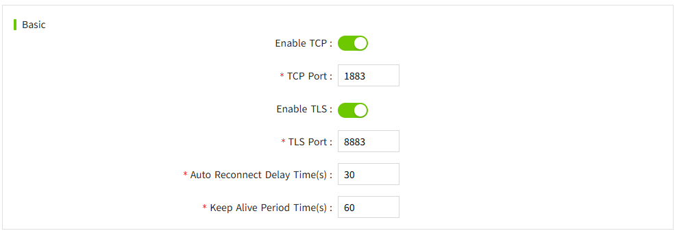
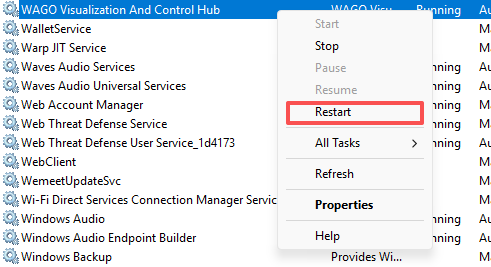

# Installation and Upgrade

## **Installation Environment**

VC Hub provides installation packages for both Windows and Linux environments. VC Hub does not support container deployment. Do not run it in a container.

If an old version is already installed in the installation environment, please uninstall it first. VC Hub does not support upgrade installation. You must uninstall the installed version before each new installation.

***Note:*** ***Please close all local anti-virus software before installation.*** ***Because some antivirus software may mistakenly identify the installation files as viruses.***

## **Ports**

The installation program defaults to using port 8066 for HTTP and port 10443 for HTTPS. Please ensure that port 8066 is available during installation. 

| **Port** | **Description**                       | **Configuration**                       |
|----------|---------------------------------------|-----------------------------------------|
| 8066     | HTTP default port                     | **"Node">"Node Settings">"Web Server"** |
| 10443    | HTTPS default port                    | **"Node">"Node Settings">"Web Server"** |
| 8099     | Networking default port               | **"Node">"Networking">"Main"**          |
| 1883     | Built-in Mqtt Broker default TCP port | **"Node">"MQTT Broker">"Basic"**        |
| 8883     | Built-in Mqtt Broker default TLS port | **"Node">"MQTT Broker">"Basic"**        |

**The http and https ports are configured as follows:**

**The networking port is configured as follows:**

**The Mqtt port is configured as follows:**

## **Reverse Proxy, Client IP, and Rate Limiting**

When VC Hub is deployed behind a load balancer or reverse proxy, configure whether the system should trust forwarded client IP headers (for example, `X-Forwarded-For`). This setting directly affects how client IP addresses are identified by security features such as rate limiting.

### **Trust Forwarded Headers Setting**

- **Enable this option** only when VC Hub is behind a trusted load balancer or reverse proxy that correctly sets and sanitizes forwarded headers.
- **Keep this option disabled** when clients connect directly to VC Hub, or when the upstream proxy is untrusted or not controlled.

Using the wrong setting can cause incorrect client IP detection.

### **Where to Configure (Package Installation)**

This option is configured in `appsettings.json` under the `ForwardedHeaders` section.

Edit the `appsettings.json` file in the VC Hub application installation directory.

After updating `ForwardedHeaders`, restart the VC Hub service for the change to take effect.

The configuration of forwarded headers depends on the deployment environment and reverse proxy setup.
For detailed guidance on how to configure trusted proxies, load balancers, and forwarded headers correctly, please refer to the official ASP.NET Core documentation.

https://learn.microsoft.com/aspnet/core/host-and-deploy/proxy-load-balancer

### **Client IP Identification for Rate Limiting**

Rate limiting relies on the resolved client IP address.

- With **trust forwarded headers disabled**, VC Hub uses the direct peer address of the incoming connection as the client IP.
- With **trust forwarded headers enabled**, VC Hub uses forwarded header information (such as `X-Forwarded-For`) to determine the original client IP, and still handles client IP resolution correctly when traffic passes through a load balancer or reverse proxy.

This ensures rate-limiting decisions are applied to the real client as accurately as possible in both direct-access and proxied deployments.

### **Firewall Recommendation (DoS / Flooding Protection)**

For production deployment, it is recommended to place a firewall in front of VC Hub to mitigate message flooding and high-frequency information request attacks (including DoS-style traffic patterns).

Application-level rate limiting and network-level protection should be used together:

- **Firewall / network controls** provide coarse-grained traffic filtering, IP blocking, and perimeter protection.
- **VC Hub rate limiting** provides application-aware request throttling and per-client control.

Rate limiting is a complementary control, not a replacement for firewall protection.

## **Version**

VC Hub uses a version structure: "Major Version. Minor Version. Revision Version". The project data version must match the version of the running program to operate.

## **Uninstallation**

The user data directory and the installation program directory are independent. Uninstalling will not delete user data. If necessary, you can manually delete the user data directory.

## **Upgrade**

Direct upgrade installation is not currently supported. Before upgrading, please uninstall first. After uninstalling, install the new version.

## **System Environment Tags**

| **Tag Name**  | **Description**   | **Windows Environment DefaultValue** | **Linux Environment DefaultValue** | **Usage Instructions** |
|:-------|:-------------|:---------|:--------------- |:----------------|
| WAGO_Visualization_And _Control_Hub_APP     | Installation directory | C:\Program Files\WAGO Visualization And Control Hub | /usr/local/bin      | Used only to record the application directory, do not modify.  |
| WAGO_Visualization_And _Control_Hub_DATA    | Data directory         | C:\ProgramData\WAGO VisualizationAndControlHub| /usr/share/wagovisualization andcontrolhub | Used to configure the VC Hub application data directory.  If not configured, the default value is used.   If you want to change the application directory, you can modify this tag value and restart the application for the configuration to take effect. |
| WAGO_Visualization_And _Control_Hub_Version | Version                | Installation program version         | Installation program version       | Used only to record the application version, do not modify.    |

## **User Data Directory**

Windows installation environment user data directory: "%ProgramData%\WAGOVisualizationAndControlHub", usually "C:\ProgramData\WAGOVisualizationAndControlHub".

Linux installation environment user data directory: /usr/share/wagovisualizationandcontrolhub

## **Restart Service**

**Windows environment**: Restart the VC Hub service in the system services.

**Linux environment**: `sudo systemctl restart virtualiztionandcontrolhub`

And you can also stop the service first: `sudo systemctl stop virtualiztionandcontrolhub` and then start the service: `sudo systemctl start virtualiztionandcontrolhub`
