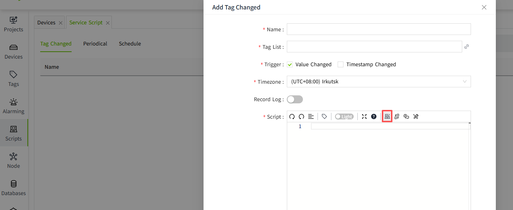
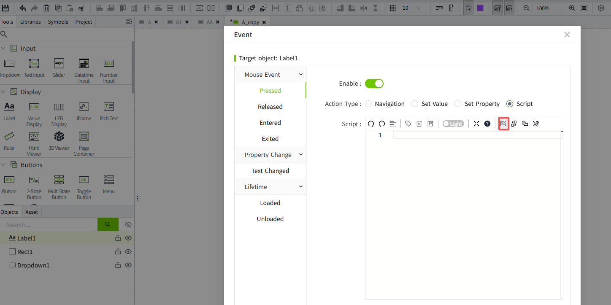
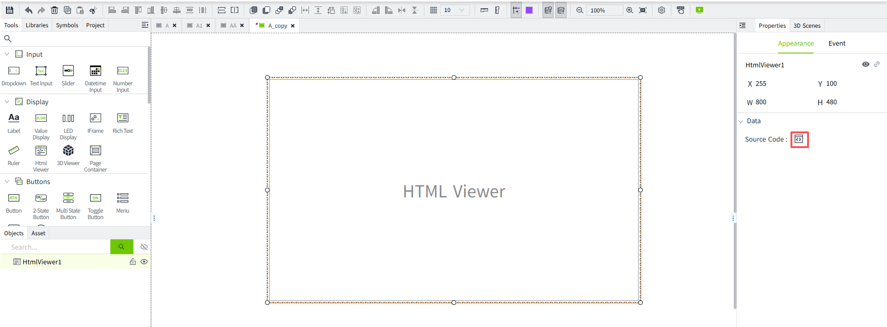

# AI

## AI Model Integration

VC Hub provides the capability to integrate external AI models but does not include or provide any AI models itself.

Before using this feature, a suitable AI model must be purchased and configured separately.

The configured AI model can be used in the following areas:

1. **Admin Console – Script**   
   Create and edit Service Functions and Shared Functions. 
   
2. **Editor – Events** 
   Create and edit scripts for pages or controls in the Event settings. 
   
3. **Control - HTML Viewer** 
   Generate HTML code. 
   

## AI Assistant

1. The AI Assistant is intended to support users during script development by generating or refining code based on user prompts. AI-generated content is provided for assistance only and should always be reviewed and validated before use.

2. The AI Assistant does not execute generated code, make autonomous decisions, or perform safety-critical functions. Any generated scripts are executed only after they have been reviewed and explicitly applied by the user.

3. If the AI Assistant is integrated into applications involving safety-critical functions, regulated products, or other compliance-sensitive scenarios, additional assessment and validation may be required to ensure that the overall solution meets the applicable regulatory and organizational requirements.

4. AI-generated content is provided by an external AI model and may be incorrect, incomplete, or unsafe. Always review the generated content before use. The AI Assistant is not intended for safety-critical or production-critical purposes.