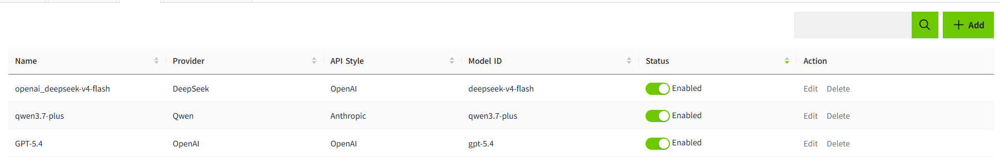
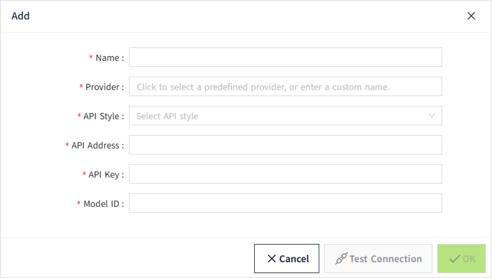
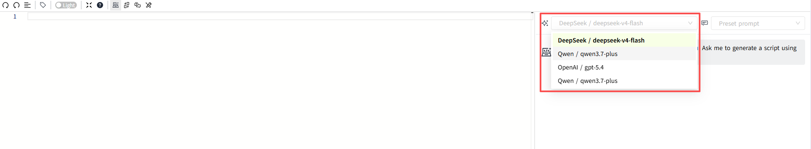

# Model

The Model list is used to configure and manage the AI models available in VC Hub. A configured model is used to process AI requests from supported VC Hub features.

Before using the AI function, you must first add the model.

Users can add a new model by clicking on the Add button in the upper right corner button of the model list.

| **Fields**          | **Description**      |
|---------------------|----------------------|
| Name      | You can define the name of the model as you wish.  |
| Provider | The provider of the model. You can select from built-in providers via dropdown, or enter manually.  |
| API Style      | Defines the API format used to communicate with the AI model. Select the API style that matches the API provided by the AI model service.  |
| API Address    | Specifies the API endpoint used to connect to the AI model service. |
| API Key   | Specifies the API key used to authenticate requests to the AI model service. |
| API Version | This field is displayed only when API Style is set to Azure OpenAI. Specifies the API version used to communicate with the AI model service.|
| Model ID    | Specifies the identifier of the AI model to be used. The Model ID must match the model provided by the configured AI service. |

After a Provider is selected, API Style and API Address are automatically populated based on the selected provider. A link for obtaining the API Key is displayed below the API Key field.

After entering the model configuration:

1. Click Test Connection to verify that the AI model is available and can be accessed successfully.
2. The model configuration can be saved only after the connection test is successful.
3. After the model is added, it is disabled by default. Enable the model manually before using it.
4. Once enabled, the model is available in the Model drop-down list in the Script Editor.
     

