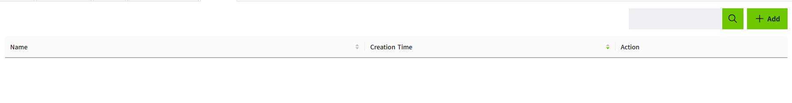
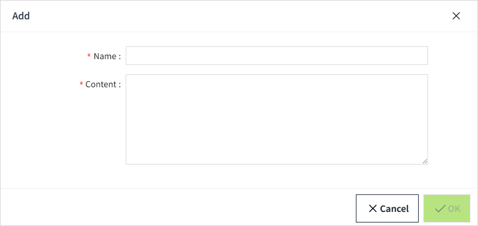
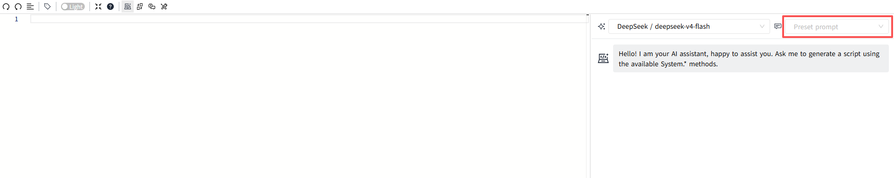

# Prompt

The Prompt defines instructions for the AI model, such as how to process a request, generate code, or format the response. Different prompts can be created for different tasks and requirements.

Users can add a new prompt by clicking on the Add button in the upper right corner button of the prompt list.

| **Fields**          | **Description**      |
|---------------------|----------------------|
| Name      | You can define the name of the prompt as you wish.  |
| Content | Defines what the AI should do and how it should respond.  |

After a Prompt is created, it can be selected from the Prompt drop-down list in the AI Assistant panel of the Script Editor. The selected Prompt provides additional instructions that guide how the AI model processes the request and generates the response.

## Example

A project may require all generated scripts to follow specific coding conventions. A custom Prompt can be created to provide these instructions to the AI model.

For example:

- **Prompt Name:** Code Generation
- **Content:** Generate clear and readable code. Use meaningful variable names and include comments where necessary. Follow the project’s coding conventions.

When the **Code Generation** Prompt is selected in the AI Assistant, the specified instructions are applied to the user's request. The AI model generates the response according to these instructions.

