# Using AI

To use the AI features, add and enable a model under AI > Model.

AI is available only in the Script Editor through the AI Assistant, which helps users quickly generate scripts.

## Where AI Can Be Used

The AI Assistant is available in all areas where scripts can be created or edited:

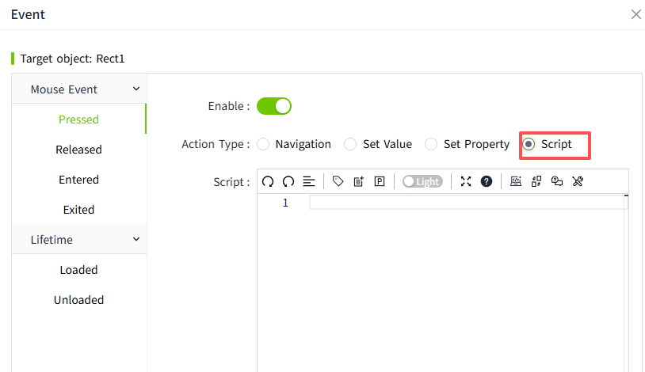

- Script->Service Script-> Tag Changed
- Script->Service Script-> Periodical
- Script->Service Script-> Schedule
- Page Event
- Control Event
- Control: HTML Viewer

## AI Assistant

In the Script Editor toolbar, click the AI Assistant icon to display the Script Editor in full-screen mode and open the AI Assistant panel on the right side of the page.

To close the AI Assistant, click the AI Assistant button in the Script Editor toolbar again.

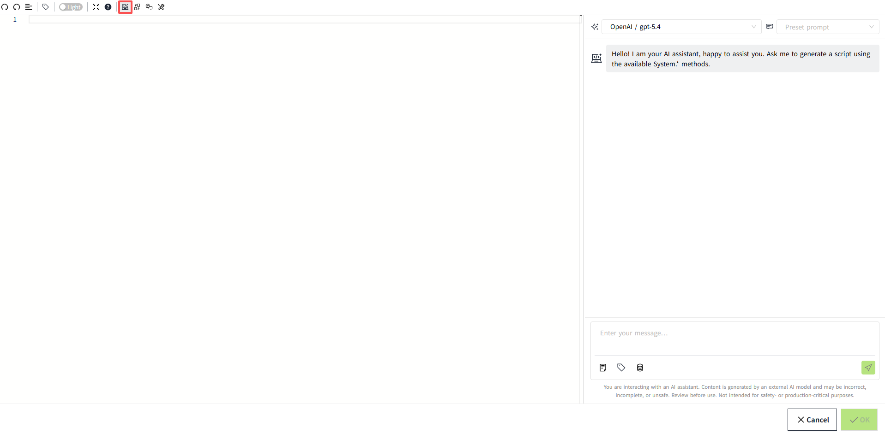

### Setting the Model

In the upper-left corner of the AI Assistant panel, select the model to be used for the current conversation.

A model must be selected before starting a conversation.

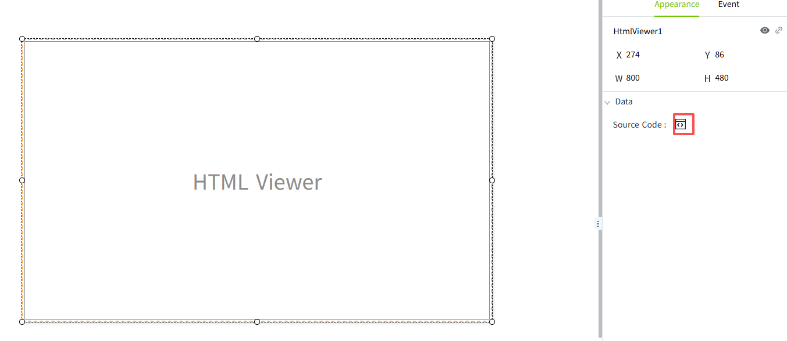

### Setting the Prompt

The Prompt option is displayed next to the model list. Select a prompt from the drop-down list to apply it to the current conversation.

Selecting a prompt is optional.

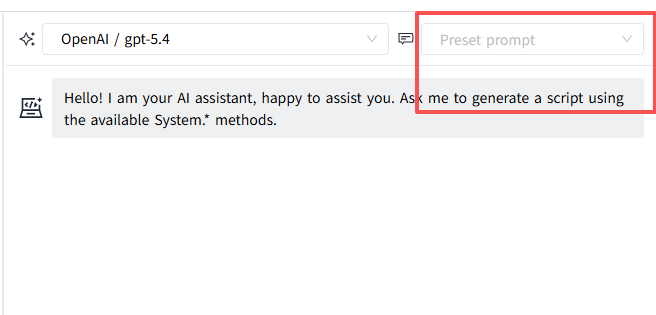

### Starting a Conversation

Enter a request in natural language in the input field to interact with the AI Assistant.

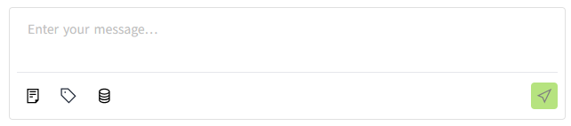

Because the AI Assistant is intended to help generate scripts, data such as tags must be explicitly selected during the conversation when they are required by the script.

For example, if the script needs to use the variable Motor1.Speed, click the Tag button and select the required variable.

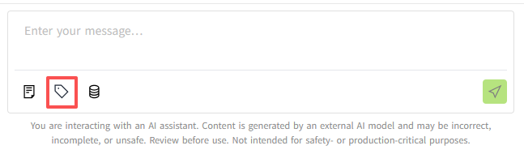

The selected data is displayed above the input field. If multiple items are selected, use the left and right arrow buttons to navigate through the selected items.

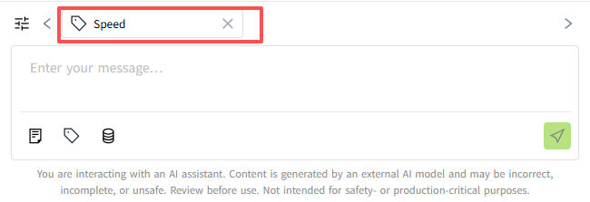

After selecting the required data, enter a natural-language request in the input field.

For example: Change the speed of Motor 1 to 2000.

Click Send. The AI Assistant automatically generates the corresponding script.

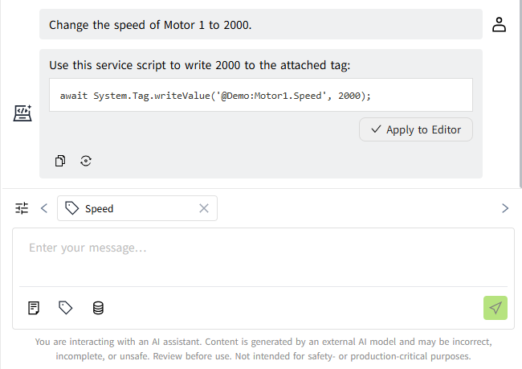

**Notes:**

1. To help the AI Assistant identify variables more accurately, use meaningful and descriptive names for variables and provide clear variable descriptions.
2. Select files, variables, and other required data according to your needs.
3. The types of files that can be selected depend on the Script Editor in use. Select the appropriate file type according to the current scripting context.
4. Content is generated by an external AI model and may be incorrect, incomplete, or unsafe. Review all generated content before use. It is not intended for safety-critical or production-critical purposes.

### Viewing Selected Files

Click the List button next to a file to open the list window. All selected data is displayed in the window and grouped by category.

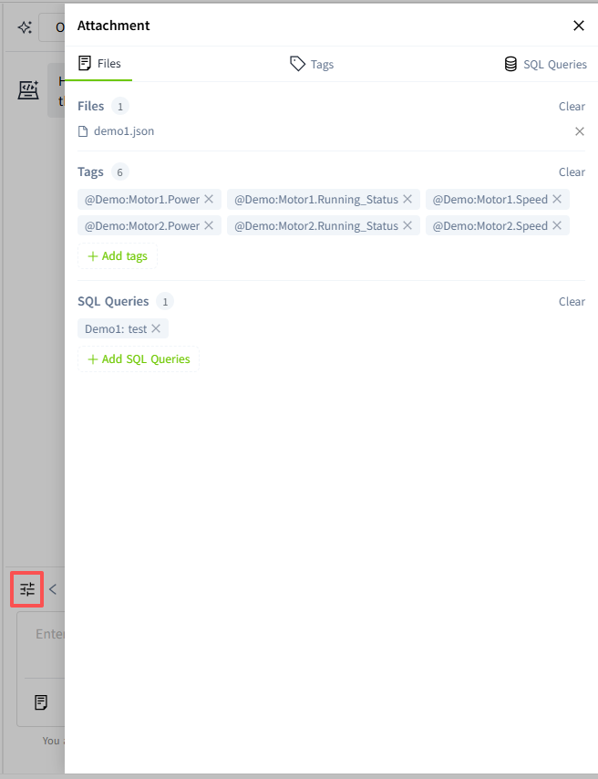

## How to Use AI

1. Add and enable a model under AI > Model.
2. Open a location that supports script editing.
3. Open the AI Assistant panel.
4. Select a model and prompt.
5. Select the required parameters, such as tags or properties, and enter a request in natural language.
6. Submit the request. The AI Assistant generates the script based on the selected prompt and user input.
7. Review the generated script and apply it if it meets the requirements.
8. Save scripts.

### Write the script

**Example:** Controlling Multiple Motors

Assume that three motors are available in the system: Motor1, Motor2, and Motor3.

The requirement is to stop all three motors when the following conditions are met:

1. The rotational speed of Motor1 exceeds 1000.
2. The rotational speed of Motor2 exceeds 1000.
3. The rotational speed of Motor3 exceeds 2000.

**Procedure:**

1. In the Script Editor, select a Model.
2. Click the Tag button below the chat input field and select the following tags:
    - `@Demo:Motor1.Speed`
    - `@Demo:Motor2.Speed`
    - `@Demo:Motor3.Speed`
    - `@Demo:Motor1.Running_Status`
    - `@Demo:Motor2.Running_Status`
    - `@Demo:Motor3.Running_Status`
3. Enter the following request in the chat input field:
```
When the rotational speeds of Motor1 and Motor2 exceed 1000, and the rotational speed of Motor3 exceeds 2000, stop all three motors.
```
4. Click Send.
5. Review the generated code in the AI Assistant panel.
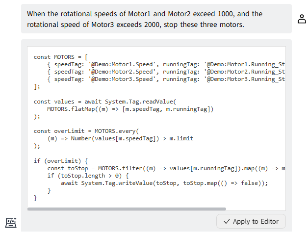
6. If the generated code is correct, click **Apply to Editor** to apply the code to the Script Editor.
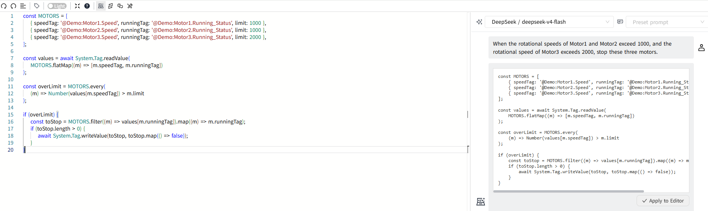
7. Exit Full Screen
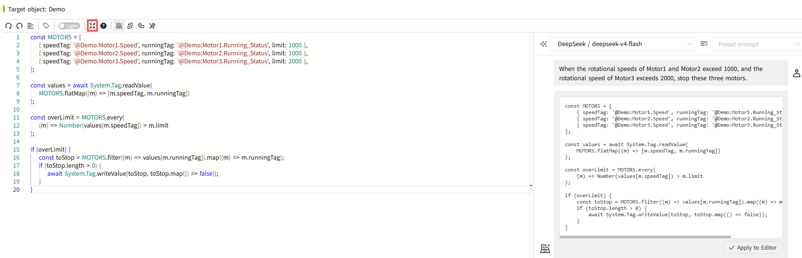
8. Save the script.
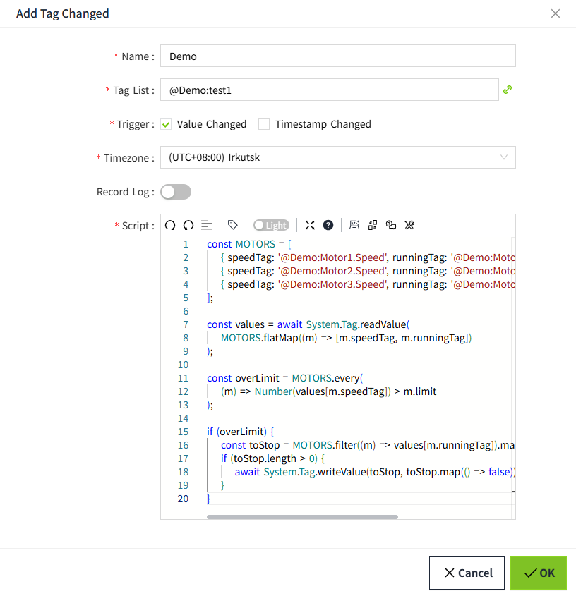

### Generate pages

**Example:** Create a page using an HTML Viewer to display the operating status and real-time data of Motor1, Motor2, and Motor3.

**Procedure:**

1. Add an HTML Viewer control to the page.
2. Click the button next to the Source Data property to open the Script Editor.
3. In the Script Editor, select a Model.
4. Click the Tag button below the chat input field and select the following tags:
    - `@Demo:Motor1.Power`
    - `@Demo:Motor2.Power`
    - `@Demo:Motor3.Power`
    - `@Demo:Motor1.Speed`
    - `@Demo:Motor2.Speed`
    - `@Demo:Motor3.Speed`
    - `@Demo:Motor1.Running_Status`
    - `@Demo:Motor2.Running_Status`
    - `@Demo:Motor3.Running_Status`
5. Enter the following request in the chat input field:
```
Display the real-time data of Motor1, Motor2, and Motor3. The page uses a dark background.
```
6. Click Send.
7. Review the generated code in the AI Assistant panel.
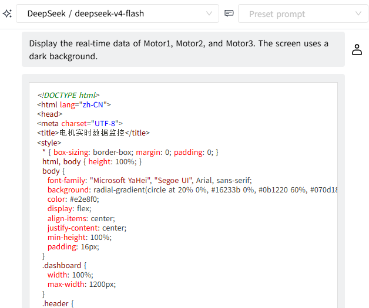
8. If the generated code is correct, click **Apply to Editor** to apply the code to the Script Editor.
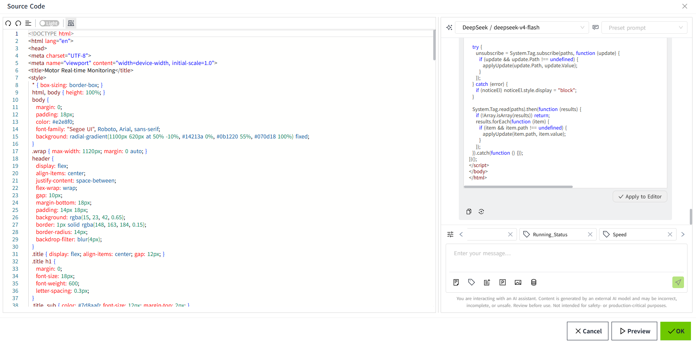
9. Click Review to preview the generated page. If the result does not meet the requirements, continue the conversation with the AI Assistant to make adjustments. If the result is satisfactory, click OK to save it.
10. After saving, the HTML Viewer displays a page similar to the following:
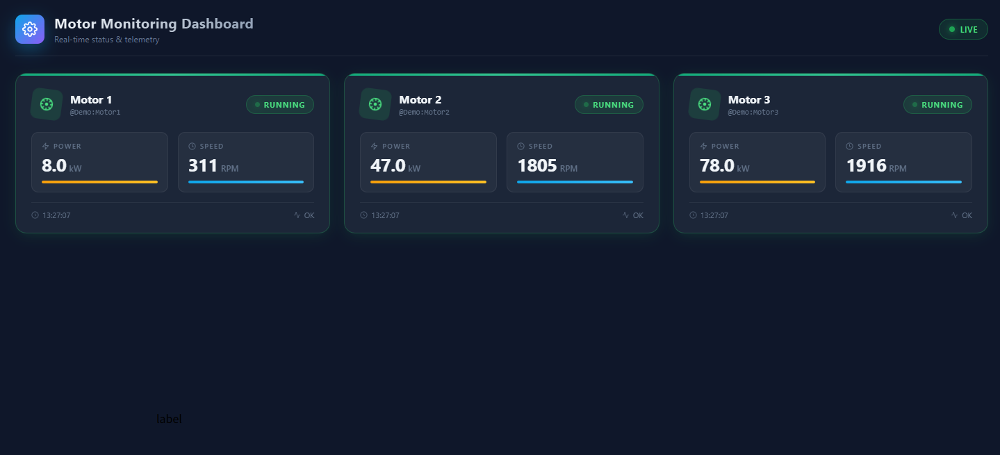
